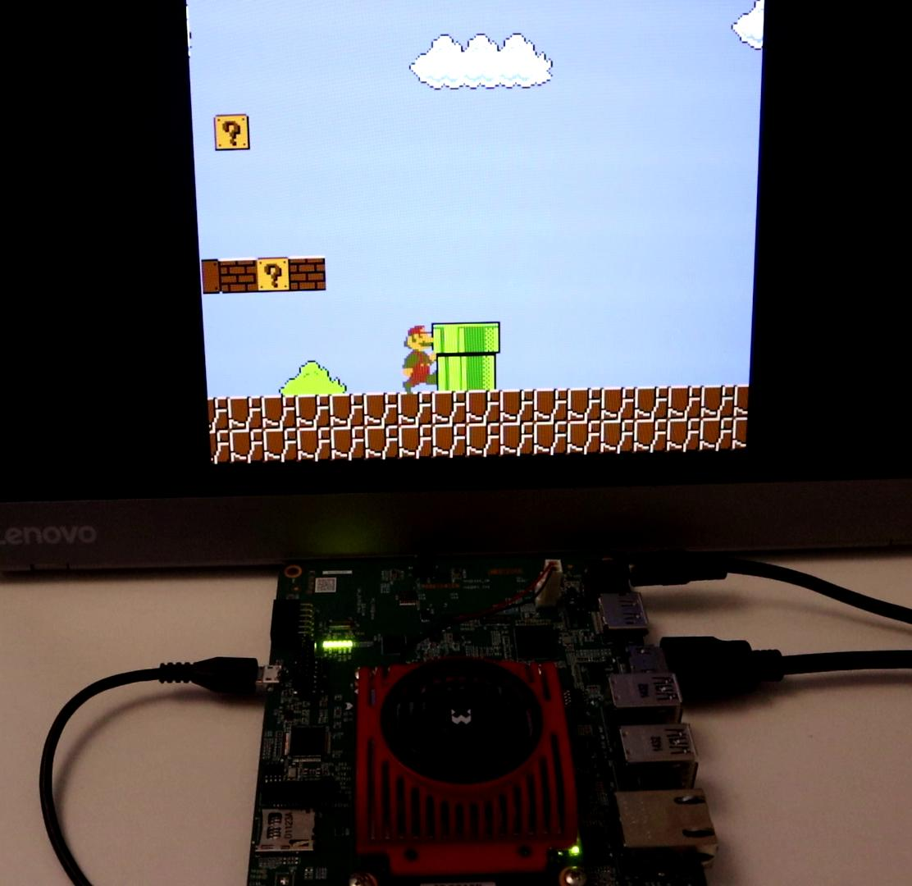

## NES260 - NES emulator for Xilinx KV260 FPGA board

This is a port of [fpganes](https://github.com/strigeus/fpganes) to the KV260 FPGA board.

Current status:
* Most of the small games works (<64K), like Super Mario Bros, Adventure Island, Gradius, Battle City.
* Video works well through HDMI.
* Audio is done through a separate PMod module (IceSugar Audio).
* Game loading and controller is handled through a python GUI on PC.

### Running NES260

Download the [binary release zip file](https://github.com/zf3/nes260/releases/tag/v1.0). Inside there's a BOOT.bin image for booting the KV260 board, and nes260.py for running on Windows.

KV260's boot process is different from most FPGA boards. It always boots from on-board QSPI flash and there's no switches/jumpers for other ways. So easiest way to boot BOOT.bin is to program it to QSPI flash. Follow [Xilinx's instructions](https://xilinx-wiki.atlassian.net/wiki/spaces/A/pages/1641152513/Kria+K26+SOM#Stand-alone-FW-Update-&-Recovery-Utility) to do it. (You will need an Ethernet cable). If you have Xilinx's Vitis/Vivado development tools installed, you can actually switch to [SD bootmode](https://xilinx.github.io/kria-apps-docs/creating_applications/1.0/build/html/docs/creating_applications_bootmodes.html). The MicroSD card preparation is as simple as formating it as FAT and copy the BOOT.BIN to it.

If you see a grey screen after boot, then NES260 is ready for loading .nes ROMs. Connect KV260 to PC with USB cable and run `pc/nes26.py` with python to load games (`pip install pyserial itertools inputs kaitaistruct importlib`, then `python nes26.py`). USB game controller should be connected to the PC (**not** KV260). My Xbox 360 controllers work fine.

To get audio, connect a [IceSugar Audio 1.2](https://www.aliexpress.com/item/1005001505255692.html) module to the PMOD port. It provides both a small speaker and a 3.5mm jack.

### How it works

[Technical details](doc/design.md) and build instructions.

### Why KV260?

Xilinx KV260 is much more powerful than the [most popular](http://misterfpga.org/) FPGA game emulation board (Intel DE10-nano), and at roughly the same price (\$200-\$250). It was just released in 2021. So it has potential for FPGA retro-gaming.

Feng Zhou, 2022-7