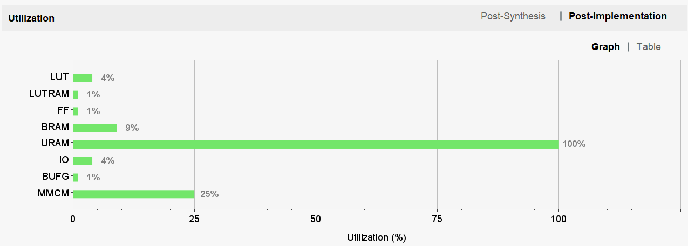

## NES260 design

Board design,


* `NES_KV260.v` is the main module. The whole NES machine (CPU, PPU, APU, memory controller, memory mapper) is in there.
* `nes_dp.v` converts NES video signal to 1080p and feeds into PS's live video input, which in turn drives HDMI output.
* Everything runs at 21.47Mhz (NES main clock) except part of nes_dp, which runs at 148.5Mhz (1080p pixel clock). Video is scaled from 256x240 to 1024x960 (4x).
* A .nes ROM is first sent to the ARM CPU (PS) through UART_1. PS program there (`sw/*`) then forward it to PL through NES_KV260's AXI4-Lite port (`s00_axi`).

Cartridge of up to 2MB are supported, which should cover 95% or more games. Cartridge ROM, internal RAM (2KB) and VRAM (2KB) are all stored in the on-chip UltraRAM (total 2304KB, used 100%). PS DDR memory is not used by FPGA. Here's a rough memory layout,

```
UltraRAM layout:
256K words, every word is 9 bytes (72 bits)
        71:64             63:0
   0 +------------+------------------+
     |  PRG RAM   |      PRG ROM     |
128K +------------+------------------+
     |Internal RAM|      CHR ROM     |
     |    VRAM    |                  |
256K +------------+------------------+
```

Final resource usage,



## Build instructions

Use Vitis/Vivado 2021.2 with [Y2K22 patch](https://support.xilinx.com/s/article/76960?language=en_US).

Vivado build,
1. Create a new project with K26 SoM. Don't forget to choose the KV260 Starter Kit board in "connections"
2. Import all source files in `fpga/hdl`.
3. Import constraints file `fpga/pmod.xdc`.
4. Create board design with `fpga/design_1.tcl`. (Tools->Run Tcl Script)
5. Generate Bitstream. Wait 10 minutes.
6. File->Export->Hardware->Include bitstream to get `nes260.xsa`.

Vitis app and boot.bin,
1. Create a platform with `nes260.xsa`
2. Create an application project `nes`, import everything in `sw/` as source code.
3. Build and get `nes_system/Debug/sd_card/BOOT.bin`.


